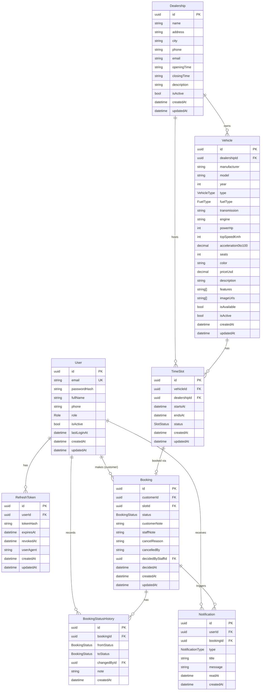

# ERD — Luxury Car Test-Drive System

> Mermaid ERD — full schema per §6 of initial_spec.md
> This is a documentation stub; will be fully populated in Phase 1 after Prisma schema is defined.

```mermaid
erDiagram
    User {
        uuid id PK
        string email UK
        string passwordHash
        string fullName
        string phone
        Role role
        bool isActive
        datetime lastLoginAt
        datetime createdAt
        datetime updatedAt
    }

    RefreshToken {
        uuid id PK
        uuid userId FK
        string tokenHash
        datetime expiresAt
        datetime revokedAt
        string userAgent
        datetime createdAt
        datetime updatedAt
    }

    Dealership {
        uuid id PK
        string name
        string address
        string city
        string phone
        string email
        string openingTime
        string closingTime
        string description
        bool isActive
        datetime createdAt
        datetime updatedAt
    }

    Vehicle {
        uuid id PK
        uuid dealershipId FK
        string manufacturer
        string model
        int year
        VehicleType type
        FuelType fuelType
        string transmission
        string engine
        int powerHp
        int topSpeedKmh
        decimal acceleration0to100
        int seats
        string color
        decimal priceUsd
        string description
        string[] features
        string[] imageUrls
        bool isAvailable
        bool isActive
        datetime createdAt
        datetime updatedAt
    }

    TimeSlot {
        uuid id PK
        uuid vehicleId FK
        uuid dealershipId FK
        datetime startsAt
        datetime endsAt
        SlotStatus status
        datetime createdAt
        datetime updatedAt
    }

    Booking {
        uuid id PK
        uuid customerId FK
        uuid slotId FK
        BookingStatus status
        string customerNote
        string staffNote
        string cancelReason
        string cancelledBy
        uuid decidedByStaffId FK
        datetime decidedAt
        datetime createdAt
        datetime updatedAt
    }

    BookingStatusHistory {
        uuid id PK
        uuid bookingId FK
        BookingStatus fromStatus
        BookingStatus toStatus
        uuid changedById FK
        string note
        datetime createdAt
    }

    Notification {
        uuid id PK
        uuid userId FK
        uuid bookingId FK
        NotificationType type
        string title
        string message
        datetime readAt
        datetime createdAt
    }

    User ||--o{ RefreshToken : "has"
    User ||--o{ Booking : "makes (customer)"
    User ||--o{ BookingStatusHistory : "records"
    User ||--o{ Notification : "receives"
    Dealership ||--o{ Vehicle : "owns"
    Dealership ||--o{ TimeSlot : "hosts"
    Vehicle ||--o{ TimeSlot : "has"
    TimeSlot ||--o| Booking : "booked via"
    Booking ||--o{ BookingStatusHistory : "has"
    Booking ||--o{ Notification : "triggers"
```

