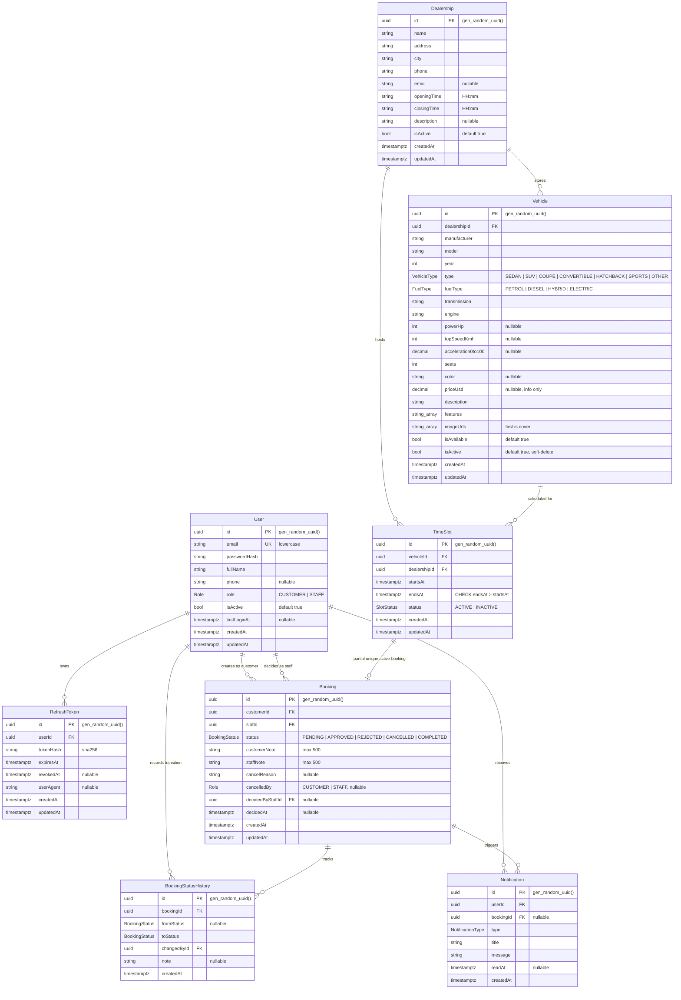

# ERD — Luxury Car Test-Drive System

> Authoritative Mermaid Entity-Relationship Diagram (§6)

```mermaid
erDiagram
    User {
        uuid id PK "gen_random_uuid()"
        string email UK "lowercase"
        string passwordHash
        string fullName
        string phone "nullable"
        Role role "CUSTOMER | STAFF"
        bool isActive "default true"
        timestamptz lastLoginAt "nullable"
        timestamptz createdAt
        timestamptz updatedAt
    }

    RefreshToken {
        uuid id PK "gen_random_uuid()"
        uuid userId FK
        string tokenHash "sha256"
        timestamptz expiresAt
        timestamptz revokedAt "nullable"
        string userAgent "nullable"
        timestamptz createdAt
        timestamptz updatedAt
    }

    Dealership {
        uuid id PK "gen_random_uuid()"
        string name
        string address
        string city
        string phone
        string email "nullable"
        string openingTime "HH:mm"
        string closingTime "HH:mm"
        string description "nullable"
        bool isActive "default true"
        timestamptz createdAt
        timestamptz updatedAt
    }

    Vehicle {
        uuid id PK "gen_random_uuid()"
        uuid dealershipId FK
        string manufacturer
        string model
        int year
        VehicleType type "SEDAN | SUV | COUPE | CONVERTIBLE | HATCHBACK | SPORTS | OTHER"
        FuelType fuelType "PETROL | DIESEL | HYBRID | ELECTRIC"
        string transmission
        string engine
        int powerHp "nullable"
        int topSpeedKmh "nullable"
        decimal acceleration0to100 "nullable"
        int seats
        string color "nullable"
        decimal priceUsd "nullable, info only"
        string description
        string_array features
        string_array imageUrls "first is cover"
        bool isAvailable "default true"
        bool isActive "default true, soft-delete"
        timestamptz createdAt
        timestamptz updatedAt
    }

    TimeSlot {
        uuid id PK "gen_random_uuid()"
        uuid vehicleId FK
        uuid dealershipId FK
        timestamptz startsAt
        timestamptz endsAt "CHECK endsAt > startsAt"
        SlotStatus status "ACTIVE | INACTIVE"
        timestamptz createdAt
        timestamptz updatedAt
    }

    Booking {
        uuid id PK "gen_random_uuid()"
        uuid customerId FK
        uuid slotId FK
        BookingStatus status "PENDING | APPROVED | REJECTED | CANCELLED | COMPLETED"
        string customerNote "max 500"
        string staffNote "max 500"
        string cancelReason "nullable"
        Role cancelledBy "CUSTOMER | STAFF, nullable"
        uuid decidedByStaffId FK "nullable"
        timestamptz decidedAt "nullable"
        timestamptz createdAt
        timestamptz updatedAt
    }

    BookingStatusHistory {
        uuid id PK "gen_random_uuid()"
        uuid bookingId FK
        BookingStatus fromStatus "nullable"
        BookingStatus toStatus
        uuid changedById FK
        string note "nullable"
        timestamptz createdAt
    }

    Notification {
        uuid id PK "gen_random_uuid()"
        uuid userId FK
        uuid bookingId FK "nullable"
        NotificationType type
        string title
        string message
        timestamptz readAt "nullable"
        timestamptz createdAt
    }

    User ||--o{ RefreshToken : "owns"
    User ||--o{ Booking : "creates as customer"
    User ||--o{ Booking : "decides as staff"
    User ||--o{ BookingStatusHistory : "records transition"
    User ||--o{ Notification : "receives"
    Dealership ||--o{ Vehicle : "stores"
    Dealership ||--o{ TimeSlot : "hosts"
    Vehicle ||--o{ TimeSlot : "scheduled for"
    TimeSlot ||--o| Booking : "partial unique active booking"
    Booking ||--o{ BookingStatusHistory : "tracks"
    Booking ||--o{ Notification : "triggers"
```
